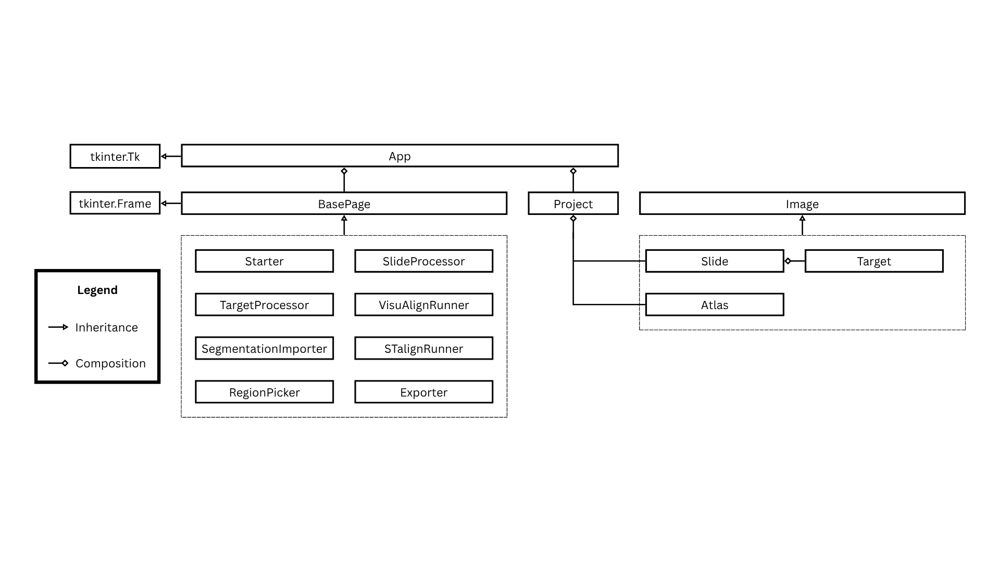

# Summary

The precise dissection of anatomically defined brain regions is the basis of many workflows in neurobiology. Traditionally, brain regions of interest are defined by visual inspection of tissue sections, followed by manual dissection. Recently, laser capture microscopes have been employed for more accurate dissection, but region identification is still challenging. This paper presents an open-source software pipeline DART ([D]{.ul}issecting [A]{.ul}tlas-[R]{.ul}egistered [T]{.ul}issue) that aligns histological brain sections to three-dimensional reference atlases and exports the resulting region-of-interest (ROI) contours for dissection by Leica Laser Microdissection (LMD) instruments. By integrating well-established image-processing libraries with a user-friendly graphical user interface, the software automates the traditionally time-consuming workflow of defining the boundaries of brain regions for dissection. With this pipeline, researchers can streamline tissue sampling for molecular analyses, while ensuring reproducibility and precision in ROI selection. 

# Statement of Need

There is a growing demand for precise, automated methods to identify and dissect regions of interest (ROIs) in histological brain sections. The brain is a highly heterogeneous organ with distinct molecular and connectomic profiles across constituent regions, making accurate region dissection critical for meaningful biological interpretation. For example, proteomic analysis of brain regions and bulk RNA sequencing approaches rely on the dissection of histologically defined brain regions[@Webb2015; @Goto-Silva2021]​. Similarly, MAPseq and other barcoded connectomics techniques depend on the precise dissection of dozens to hundreds of brain regions to analyze how individual neurons project to these regions[@Huang2020; @Kim2025; @Kebschull2016; @Chen2019]​. Laser microdissection (LMD) enables such precise dissection by cutting cell-stained tissue with an ultraviolet laser that can be controlled with high accuracy. However, current approaches using LMD generally rely on manual delineation of brain regions. This manual selection is error-prone and time consuming, especially when many samples need to be dissected. Moreover, the lack of a standardized region selection makes it difficult to ensure consistent, reproducible sampling across experiments and laboratories. There are many existing open-source tools such as STalign [@Clifton2023], QuickNII [@Puchades2019], and VisuAlign [@Puchades2019] that can align an image of a histological brain section to a reference brain atlas in order to identify and segment the brain regions​. However, no tools exist that integrate atlas alignment of brain section images and brain region selection with Leica LMD software to enable the seamless and precise dissection of those regions. 

Our open-source DART pipeline addresses this gap by providing: 
1. Automated or semi-automated alignment of 2D brain sections to a 3D reference brain atlas (e.g., the Allen Brain Atlas CCFv3 2017 [@Wang2020]​) and atlas-based segmentation. 
2. Seamless integration with Leica LMD software for laser dissection.
3. Clear documentation and an accessible, modular codebase, facilitating further development and customization by the community. 

Additionally, DART facilitates high-throughput processing of brain sections by minimizing user engagement time. The majority of the existing user engagement time is spent estimating and manually adjusting the atlas-to-brain section transform, which is facilitated by DART’s intuitive controls. The remaining steps require minimal input, allowing the user to attend to other tasks.

# Software Overview

## Key Features

1. **Brain Section Preprocessing**
    - Automatic or user-assisted cropping and background intensity correction for raw histological images.
2. **Atlas Alignment**
    - Combination of STalign [@Clifton2023]​ for landmarked-based semi-automatic registration and Visualign [@Puchades2019]​ for manual registration to a 3D reference brain atlas (e.g., Allen Mouse Brain Atlas​ [@Wang2020]​). 
    - Generation of affine and non-linear transformations to map 2D section coordinates onto known brain regions. 
3. **ROI Definition and Export**
    - User-guided selection of atlas-defined regions in the aligned sections. 
    - Conversion of these regions into outlines stored in `.xml` shape files suitable for use by a Leica LMD. 
    - Ability to store metadata (e.g., atlas region names) along with the exported ROI shapes.
4. **GUI Control**
    - A GUI for real-time quality control and manual correction of section alignment. 
5. **Modularity and Extensibility**
    - Written primarily in Python, making use of libraries such as scikit-image, NumPy, and PyTorch for image processing and transformations. 
    - Open-source architecture allowing advanced users to plug in new registration algorithms, customize region-detection heuristics, or adapt to different species and atlases. 
6. **High-throughput Multi-Sample Processing**
    - Slide segmentation tools allow users to upload images of whole slides with multiple sections and export the ROI outlines.
7. **Integration with LMD**
    - Simple shape import process using Leica's `.xml` template.
    - Flexibility in selecting the magnification at which laser dissection of ROIs is performed, with the ability to switch between magnifications as needed without requiring redrawing of shapes 

## Implementation and Architecture 

1. **Programming Languages and Dependencies**
    - The core modules are implemented in Python, leveraging libraries such as Tkinter, NumPy, Matplotlib, STalign, Shapely, NiBabel, and Pynrrd. 
2. **Overall Workflow** (\autoref{fig1}):
    1. **Input:** The user provides high-resolution cell stained (e.g. DAPI or Nissl stained) images of the slide containing the brain section(s) (commonly in TIFF or PNG) and selects the corresponding section level in the 3D atlas.
    2. **Section Definition:** In the case that multiple sections are contained in a single image, the user delineates the bounding boxes for each section.
    3. **Run STalign:** A semi-automatic alignment between the atlas and the section(s) is performed using STalign.
    4. **VisuAlign Adjustment:** The user can visualize the atlas defined region boundaries on the cytoarchitecture to confirm alignment accuracy and, if necessary, manually adjust the alignment using VisuAlign.
    5. **ROI Selection:** The user selects ROIs (e.g., hippocampal subregions, cortical layers) to be exported. DART currently exploits the hierarchical region organization of the Allen Mouse Brain Reference Atlas to enable ROI definition of both coarse regions (e.g. primary motor area) and finer regions (e.g. layer 1 of primary motor cortex).
    6. **ROI Export:** These ROIs are then saved in an XML format that Leica LMD software can import, allowing precise laser dissections.

![**The DART workflow.** The 3D renderings of the Allen atlas were produced using brainrender [@Wang2020; @Claudi2021]​.\label{fig1}](workflow.png)

3. **Software Architecture**
    - DART follows an object-oriented framework (\autoref{fig2})

# Application 

To demonstrate its utility, we applied DART to dissect the primary and secondary somatomotor areas and the anterior commissure from a coronal section of an adult mouse brain (\autoref{fig3}). Starting with a Nissl-stained section, we used DART to align the section to a DAPI-based atlas [@Stger2020]​ and generated outlines for the target regions. Importing these outlines into the Leica LMD system enabled precise laser cutting. 

![**A DART use case.** A DART application begins with an image of the original section. It then generates a segmentation, selects desired regions, and exports to the LMD for cutting or etching with the laser as desired. Note: Images were restitched using the Stitching plugin in ImageJ [@Preibisch2009]​.\label{fig3}](dissection_results.png)

# Discussion and Limitations 

Our open-source workflow greatly simplifies consistent region identification and dissection across multiple brain sections. However, certain limitations remain:

- **Staining Variability:** Significant differences in staining intensity or section thickness can reduce alignment accuracy. 
- **Atlas Mismatch:** Anatomical variability between individual subjects and the reference atlas may necessitate manual adjustment, especially in samples from disease models. 
- **Tissue Damage:** Significant deformation to sections from holes or tears in the tissue can reduce alignment accuracy.  
- **ROI Complexity:** Highly intricate or irregular regions might require manual editing of automatically generated ROIs. 

Future improvements of DART may include support for alternative alignment algorithms, expanded atlas selection covering additional species and organ systems, and expanded compatibility with additional microscope systems beyond Leica LMD.

# Conclusions 

Here we present an open-source pipeline that aligns histological brain sections to 3D reference atlases and seamlessly exports brain-region defined ROIs for Leica Laser Microdissection. By automating key steps in the tissue sampling process, researchers can reduce manual labor, improve reproducibility, and accelerate downstream molecular assays. The modular, documented codebase invites community contributions and adaptation to new species, atlases, and laboratory workflows. 

## Code Availability: 

DART is hosted on Github: https://github.com/rk324/Dissecting-Atlas-Registered-Tissue 

## Installation: 

DART is distributed as a pre-compiled Windows binary in a standalone folder that includes all necessary dependencies. To use the software, download and extract the entire folder from the [Google Drive link](https://drive.google.com/file/d/1UHvkmNt6kgneh7vLTZS29K53wJkYFOEJ/view?usp=sharing), then run the `main.exe` file inside—no installation or separate Python environment is required. See the [tutorial](https://github.com/rk324/Dissecting-Atlas-Registered-Tissue/tree/main/tutorials) for instructions on usage. 

## Data Collection 

All mouse procedures were conducted in accordance with the Johns Hopkins University Animal Care and Use Committee (ACUC) protocols MO20M376 and MO23M346. Mice were maintained on a 12-hour light/dark cycle with ad libitum access to food and water. Brain sections for LMD were prepared as previously described​ [@Kim2025_]​. 

## Acknowledgments 

We would like to thank the open-source community for providing foundational libraries such as VisuAlign, STalign, and Tkinter. This work was supported by SFARI grant 875575 and NIH grants DP1DA056668 and RF1AG078378 to JMK and a Kavli NDI Distinguished predoctoral fellowship to MA. 

## Conflicts of interest 

The authors declare no conflicts of interest. 

# References