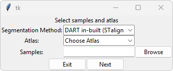
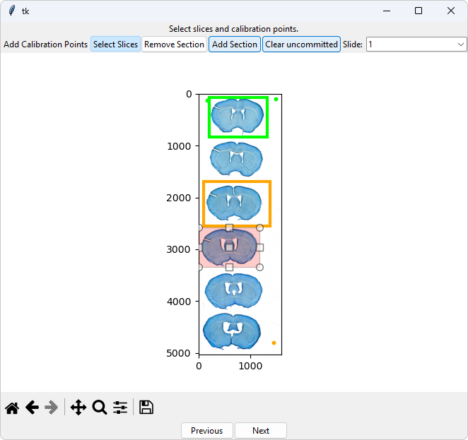
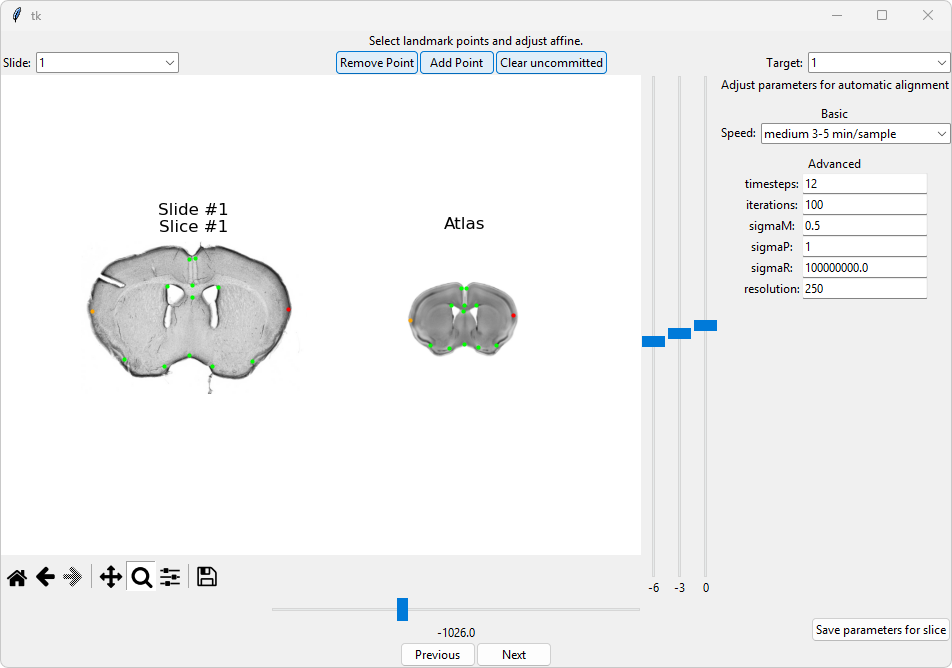
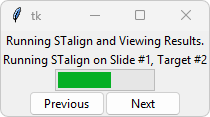
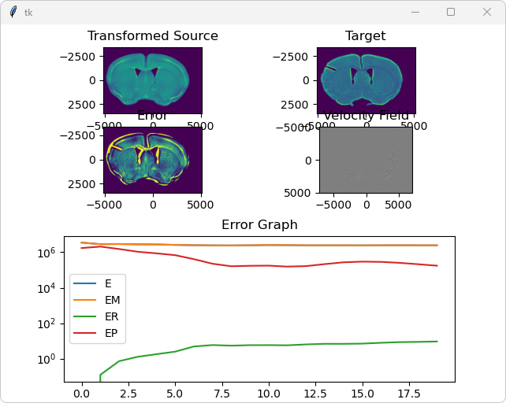
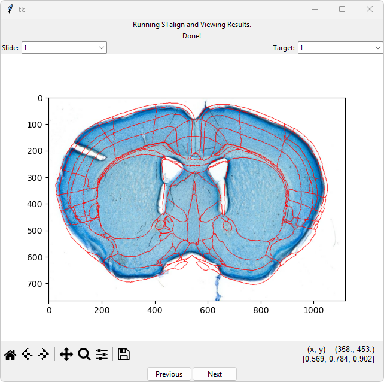
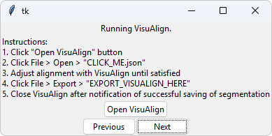
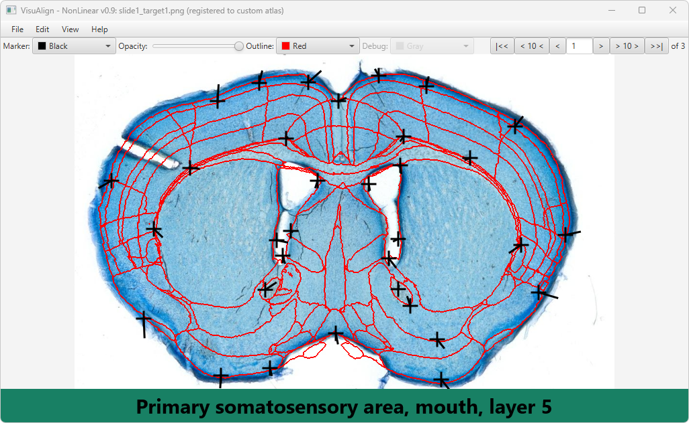
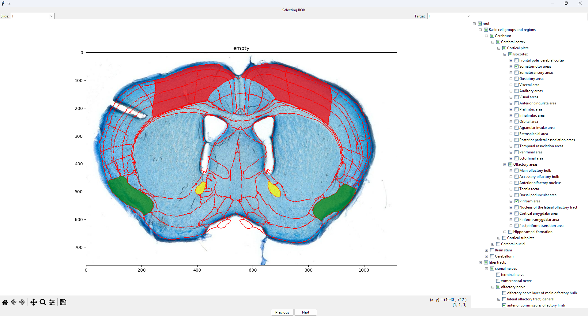
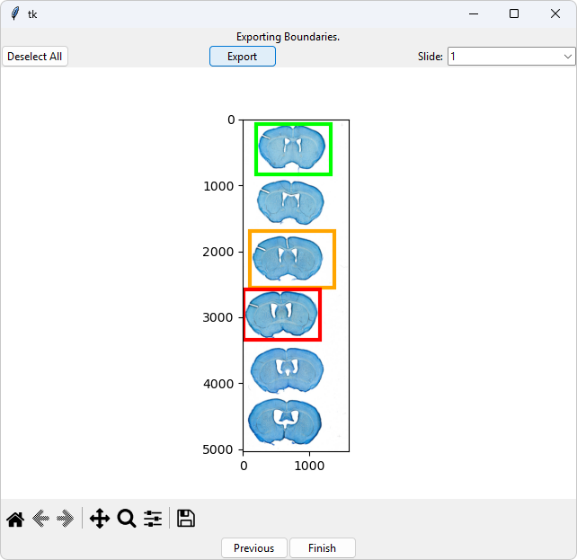

# User Guide

## Installation

`DART` is distributed as a pre-compiled Windows binary in a standalone folder that includes all necessary dependencies. To use the software, download and extract the entire folder from the [Google Drive link](https://drive.google.com/file/d/1UHvkmNt6kgneh7vLTZS29K53wJkYFOEJ/view?usp=sharing), then run the `main.exe` file inside—no installation or separate Python environment is required.

## Getting Started

Prior to using `DART`, calibration points must be added to the slide. Although natural landmarks on the sample can be used, we recommend creating artificial calibration points that can be reliably located. To do this, use the laser to mark cross-shaped fiducials in the slide membrane at the top left, top right, and bottom right corners of the slide ([Figure 1](#fig-1)). Then, take an overview image of the whole slide, including fiducial crosses, to use in `DART`.

## Load the Data

On the `DART` starter page ([Figure 2](#fig-2)), select an atlas from several options with varying resolutions and imaging workups. Atlases comprise three components: a reference atlas that contains the spatial cell density of the organ of interest, a labels atlas that maps each voxel from the reference atlas to an ID corresponding to a specific region in the tissue, and a table containing information about the regions and their hierarchical structure. In addition to selecting an atlas, select the sample images by clicking **Browse** and selecting the folder containing the images. `DART` will load each image in the folder as a separate slide and create a subfolder to store results and intermediate files. The name of the subfolder will follow the format `DART-[datetime]`.

## Mark Calibration Points and Select Sections

On the slide processing page ([Figure 3](#fig-3)), the **Add Calibration Points** tab is selected by default. Annotate the calibration points (marked earlier with the LMD) by clicking on the calbration point and then selecting **Add Point** on the top panel. Next, switch to the **Select Slices** tab on the top panel and drag a box around each section to delineate the individual sections. Since multiple sections can be mounted on a single slide, this allows for bulk processing of several sections on each slide. When annotating images in this software, a common color scheme is used. Red annotations have not been saved, green annotations have been saved, and orange annotations have been recently saved and can be removed with a corresponding button at the top of the page. This color scheme is also applied when annotating calibration points, and it continues throughout the software.

## Prepare for STalign

The Section Processor Page ([Figure 4](#fig-4)) serves three functions: estimation of an affine transformation to map the atlas to the target section, annotation of landmark points, and adjustment of STalign parameters. Use the bottom slider to approximate the section in your 3D atlas that best matches the section. Use the three sliders on the right to adjust the rotation angles of the atlas to more closely match the slice. This is your initial "guess" for the alignment, and even if it's not perfect, it will greatly speed up on converging on a proper alignment.

Next, add landmark points by clicking corresponding landmarks on the target section image and the atlas image, then clicking “Add Point” in the top panel. 

Finally, you can tune the parameters of STalign either at a high-level through the dropdown menu or in detail through the text entries. The slower transforms are generally more accurate. You can save these parameters by clicking **Save parameters for slice** in the bottom right. 

If you have multiple slices, you can navigate to the different slices using the **Target** panel on the top right, and initialize an alignment for each one. 

## Run STalign and View Results

In the STalign Runner Page ([Figure 5,6,7](#fig-5)), STalign is run on the section images when the “Run” button is clicked. Upon completion of STalign, the results are displayed by overlaying the calculated region boundaries over the section image ([Figure 7](#fig-7)). 

## Adjust Alignment

In the VisuAlign Runner page ([Figure 8](#fig-8)), make manual adjustments to the alignment using VisuAlign ([Figure 9](#fig-9)*). This enables greater control over the alignment. Since VisuAlign is a separate software, `DART` opens it through the command terminal, when you click **Open VisuAlign**. 

You will find the `CLICK ME` file in the `DART-[datetime]` subfolder with your section images. You can do this by hitting the space bar on a region you wish to move, which should make a cross appear. You can then move the cross around to adjust the local alignment. If you have multiple slices, you can navigate slices with the arrows in the top right corner.  After adjusting the alignment, export the alignment to the EXPORT_VISUALIGN_HERE folder, and close VisuAlign. 

## Select ROIs

In the region selection page ([Figure 10](#fig-10)), select the regions of interest (ROIs). This can be done by either clicking on the ROIs in the image or by navigating to and toggling the checkbox of the region in the tree view. Each has three possible states: unchecked, checked (marked by a check mark), and tristate (marked by a filled box). Unchecked regions will not be exported for dissection. Checked regions and all their child regions are stitched together for combined dissection. Tristate regions are the ancestors of checked regions that are exported and dissected separately. This distinction between checked and tristate regions allows dissection of fine and broad groups of regions. For example you could define and dissect the entire cerebral cortex by using a checked box for parent **Cerebral Cortex** and all child regions. Or, you could use a filled box (tristate) for parent **Cerebral cortex**, and all immediate child regions (i.e. Visual Cortex, Somatosensory cortex, etc) that are checked are exported and dissected separately.

## Export ROI Boundaries

The export page ([Figure 11](#fig-11)) allows the user to select sections for export. All the sections of a slide can be exported together in one batch file for the slide, or individual sections can be exported. This allows the user to group their LMD cutting jobs as desired. The `.xml` files necessary for LMD dissection are in the `DART-[datetime]` subfolder, under the subfolder `output`.

## Import to LMD

Before importing shapes onto the LMD, switch the LMD to the desired objective for cutting. For example, if the user wants to cut their shapes using the 10x objective, then they must first switch to that objective. Then, click File > Import Shapes and select the `.xml` file containing the shape(s) to be imported. This will trigger a series of prompts to select shapes and calibrate the LMD. Navigate through these prompts until the final prompt, “Use the actual magnification for all imported shapes?”, is reached. Click “Yes”. 

The shapes list should populate with the imported shapes. Select a shape to view it overlaid on the section, and click “Start cut” to initiate the laser dissection process for this shape. Alternatively, all the shapes may be selected and dissected. Note that `DART` automatically assigns wells to each shape, spaced out with one well in between. These well assignments may be adjusted in the Leica LMD software.

### **Figure 1. Cross Fiducial Example**
  

### **Figure 2. Starter Page**
  

### **Figure 3. Slide Processing Page**
  

### **Figure 4. Section Processor Page**
  

### **Figure 5. STalign Runner Page**
  

### **Figure 6. STalign Progress Monitor**
  

### **Figure 7. STalign Results Display**
  

### **Figure 8. VisuAlign Runner Page**
  

### **Figure 9. VisuAlign**
  

### **Figure 10. Region Selection Page**
  

### **Figure 11. Export Page**
  

